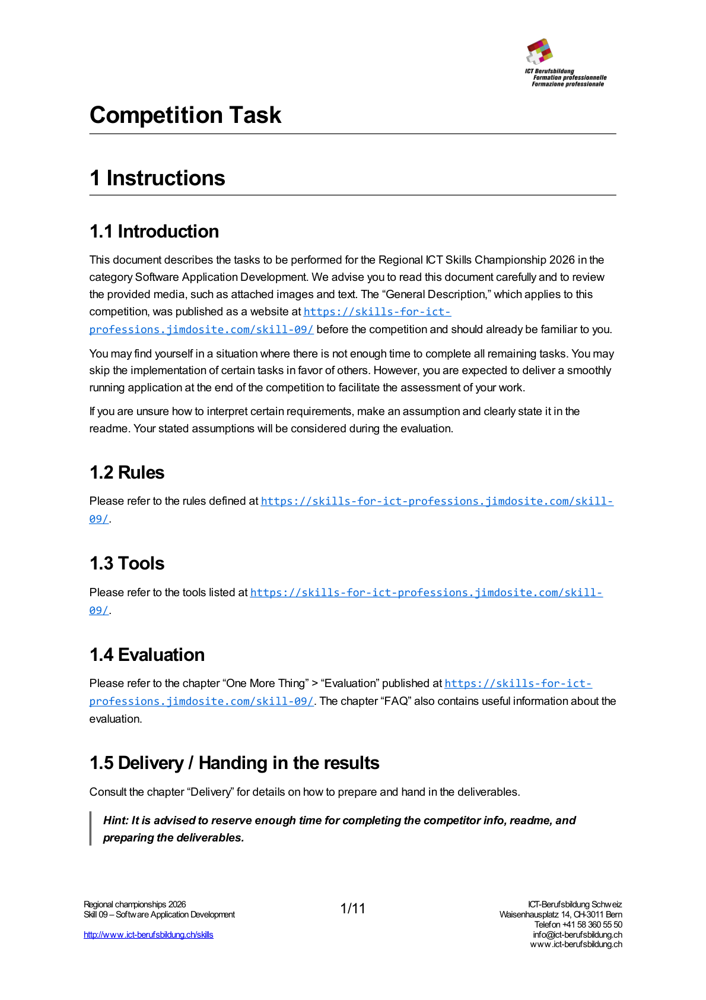
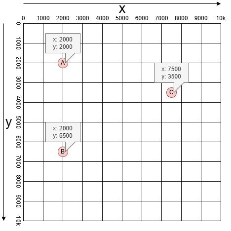
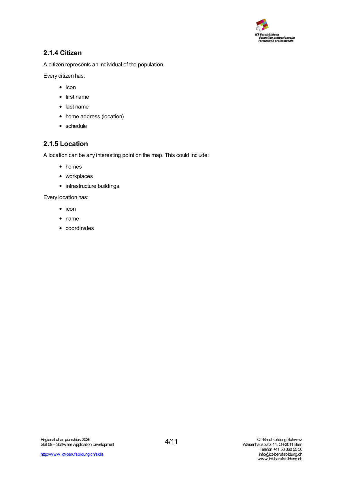
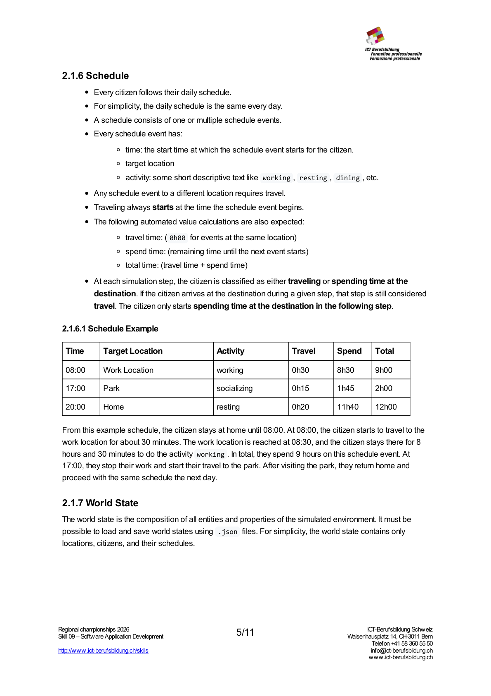
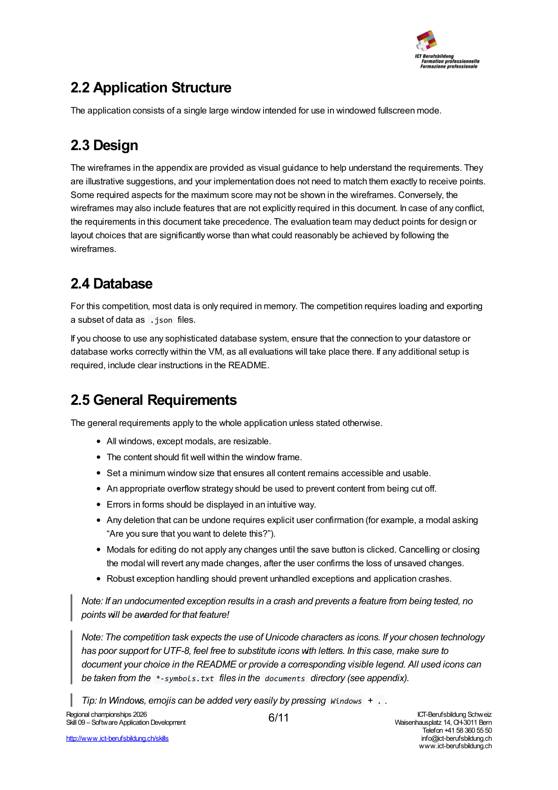
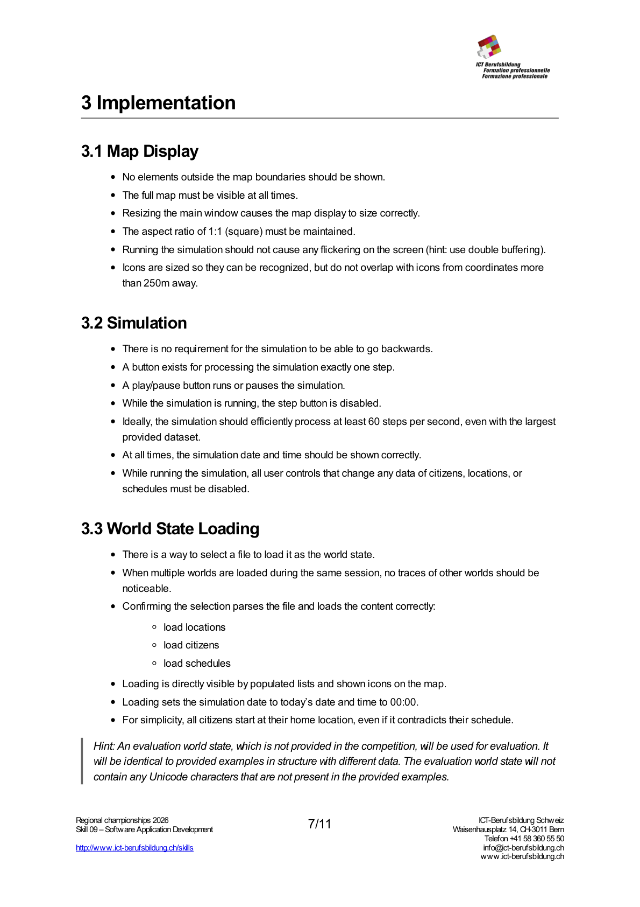
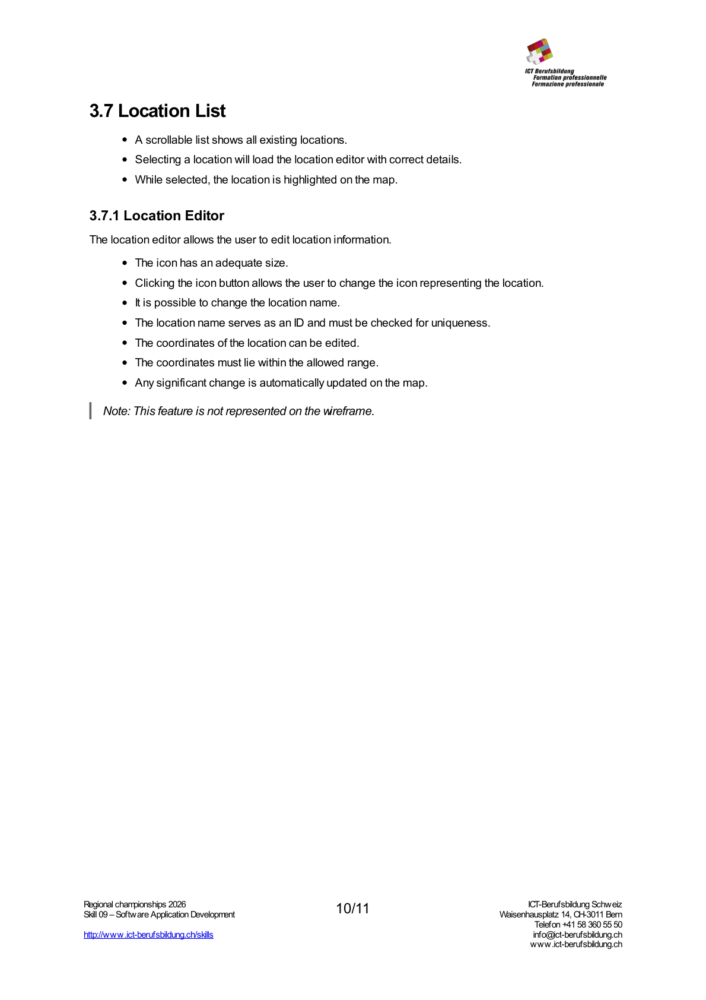
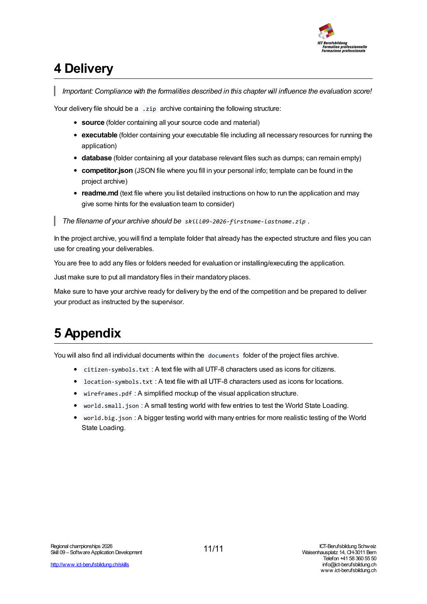

# competition_skill9_2026

> **Source:** competition_skill9_2026.pdf  
> **Pages:** 11  
> **Visual Content:** 8 image(s) extracted  

---

## Page 1

### Visual Content

**Diagram/Wireframe** (1190x1684, 0 colors):

### Text Content

Competition Task
1 Instructions
1.1 Introduction
This document describes the tasks to be performed for the Regional ICT Skills Championship 2026 in the
category Software Application Development. We advise you to read this document carefully and to review
the provided media, such as attached images and text. The “General Description,” which applies to this
competition, was published as a website at https://skills-for-ict-
professions.jimdosite.com/skill-09/ before the competition and should already be familiar to you.
You may find yourself in a situation where there is not enough time to complete all remaining tasks. You may
skip the implementation of certain tasks in favor of others. However, you are expected to deliver a smoothly
running application at the end of the competition to facilitate the assessment of your work.
If you are unsure how to interpret certain requirements, make an assumption and clearly state it in the
readme. Your stated assumptions will be considered during the evaluation.
1.2 Rules
Please refer to the rules defined at https://skills-for-ict-professions.jimdosite.com/skill-
09/.
1.3 Tools
Please refer to the tools listed at https://skills-for-ict-professions.jimdosite.com/skill-
09/.
1.4 Evaluation
Please refer to the chapter “One More Thing” > “Evaluation” published at https://skills-for-ict-
professions.jimdosite.com/skill-09/. The chapter “FAQ” also contains useful information about the
evaluation.
1.5 Delivery / Handing in the results
Consult the chapter “Delivery” for details on how to prepare and hand in the deliverables.
Hint: It is advised to reserve enough time for completing the competitor info, readme, and
preparing the deliverables.
1/11

---

## Page 2

### Text Content

2 Project Introduction
Open-world games often promise vibrant, living worlds, yet their sheer scale can make it difficult to give
every inhabitant a persistent and believable life.
The Population Simulation Prototype represents a simplified open world in which the entire population
exists independently of the main game. It maintains citizens, their homes, and their daily schedules in a
continuously progressing background simulation, allowing nearby individuals to appear naturally when
needed.
In this competition, you will implement a reduced version consisting of a map with relevant locations and
citizens who move between them according to predefined daily routines.
2.1 Population Simulation
This chapter describes how the simulation is expected to work. Details on how the application should
function are defined in the later chapter “Application Structure”.
2.1.1 General
For simplicity, the following assertions apply throughout the competition:
Every single simulation step spans exactly 1 minute.
The travel route is always a direct line from departure to destination location (no roads).
The travel speed of all citizens is exactly 5 km/h.
2.1.2 Map
The map is always a square of fixed size: 10km by 10km.
2/11

---

## Page 3

### Visual Content

**Diagram/Wireframe** (468x468, 804 colors):

### Text Content

2.1.3 Coordinate System
In this competition, a coordinate represents any geographical location on the map and consists of
an x  and y  component.
x  goes from left to right and represents the horizontal distance from the top-left corner of the map.
y  goes from top to bottom (which makes it easier to present on a computer screen) and
represents the vertical distance from the top-left corner of the map.
In this competition, a valid x  or y  value is in the range of 0  to 10000 .
visual help to understand x y coordinate system
Tip: The 2D distance between two coordinates (a.x, a.y)  and (b.x, b.y)  can be calculated using
the Euclidean distance formula: distance(a, b) = sqrt((b.x - a.x)^2 + (b.y - a.y)^2) .
3/11

---

## Page 4

### Visual Content

**Diagram/Wireframe** (1190x1684, 0 colors):

### Text Content

2.1.4 Citizen
A citizen represents an individual of the population.
Every citizen has:
icon
first name
last name
home address (location)
schedule
2.1.5 Location
A location can be any interesting point on the map. This could include:
homes
workplaces
infrastructure buildings
Every location has:
icon
name
coordinates
4/11

---

## Page 5

### Visual Content

**Diagram/Wireframe** (1190x1684, 0 colors):

### Text Content

2.1.6 Schedule
Every citizen follows their daily schedule.
For simplicity, the daily schedule is the same every day.
A schedule consists of one or multiple schedule events.
Every schedule event has:
time: the start time at which the schedule event starts for the citizen.
target location
activity: some short descriptive text like working , resting , dining , etc.
Any schedule event to a different location requires travel.
Traveling always starts at the time the schedule event begins.
The following automated value calculations are also expected:
travel time: ( 0h00  for events at the same location)
spend time: (remaining time until the next event starts)
total time: (travel time + spend time)
At each simulation step, the citizen is classified as either traveling or spending time at the
destination. If the citizen arrives at the destination during a given step, that step is still considered
travel. The citizen only starts spending time at the destination in the following step.
2.1.6.1 Schedule Example
Time
Target Location
Activity
Travel
Spend
Total
08:00
Work Location
working
0h30
8h30
9h00
17:00
Park
socializing
0h15
1h45
2h00
20:00
Home
resting
0h20
11h40
12h00
From this example schedule, the citizen stays at home until 08:00. At 08:00, the citizen starts to travel to the
work location for about 30 minutes. The work location is reached at 08:30, and the citizen stays there for 8
hours and 30 minutes to do the activity working . In total, they spend 9 hours on this schedule event. At
17:00, they stop their work and start their travel to the park. After visiting the park, they return home and
proceed with the same schedule the next day.
2.1.7 World State
The world state is the composition of all entities and properties of the simulated environment. It must be
possible to load and save world states using .json  files. For simplicity, the world state contains only
locations, citizens, and their schedules.
5/11

---

## Page 6

### Visual Content

**Diagram/Wireframe** (1190x1684, 0 colors):

### Text Content

2.2 Application Structure
The application consists of a single large window intended for use in windowed fullscreen mode.
2.3 Design
The wireframes in the appendix are provided as visual guidance to help understand the requirements. They
are illustrative suggestions, and your implementation does not need to match them exactly to receive points.
Some required aspects for the maximum score may not be shown in the wireframes. Conversely, the
wireframes may also include features that are not explicitly required in this document. In case of any conflict,
the requirements in this document take precedence. The evaluation team may deduct points for design or
layout choices that are significantly worse than what could reasonably be achieved by following the
wireframes.
2.4 Database
For this competition, most data is only required in memory. The competition requires loading and exporting
a subset of data as .json  files.
If you choose to use any sophisticated database system, ensure that the connection to your datastore or
database works correctly within the VM, as all evaluations will take place there. If any additional setup is
required, include clear instructions in the README.
2.5 General Requirements
The general requirements apply to the whole application unless stated otherwise.
All windows, except modals, are resizable.
The content should fit well within the window frame.
Set a minimum window size that ensures all content remains accessible and usable.
An appropriate overflow strategy should be used to prevent content from being cut off.
Errors in forms should be displayed in an intuitive way.
Any deletion that can be undone requires explicit user confirmation (for example, a modal asking
“Are you sure that you want to delete this?”).
Modals for editing do not apply any changes until the save button is clicked. Cancelling or closing
the modal will revert any made changes, after the user confirms the loss of unsaved changes.
Robust exception handling should prevent unhandled exceptions and application​ crashes.
Note: If an undocumented exception results in a crash and prevents a feature from being tested, no
points will be awarded for that feature!
Note: The competition task expects the use of Unicode characters as icons. If your chosen technology
has poor support for UTF-8, feel free to substitute icons with letters. In this case, make sure to
document your choice in the README or provide a corresponding visible legend. All used icons can
be taken from the *-symbols.txt  files in the documents  directory (see appendix).
Tip: In Windows, emojis can be added very easily by pressing Windows  + . .
6/11

---

## Page 7

### Visual Content

**Diagram/Wireframe** (1190x1684, 0 colors):

### Text Content

3 Implementation
3.1 Map Display
No elements outside the map boundaries should be shown.
The full map must be visible at all times.
Resizing the main window causes the map display to size correctly.
The aspect ratio of 1:1 (square) must be maintained.
Running the simulation should not cause any flickering on the screen (hint: use double buffering).
Icons are sized so they can be recognized, but do not overlap with icons from coordinates more
than 250m away.
3.2 Simulation
There is no requirement for the simulation to be able to go backwards.
A button exists for processing the simulation exactly one step.
A play/pause button runs or pauses the simulation.
While the simulation is running, the step button is disabled.
Ideally, the simulation should efficiently process at least 60 steps per second, even with the largest
provided dataset.
At all times, the simulation date and time should be shown correctly.
While running the simulation, all user controls that change any data of citizens, locations, or
schedules must be disabled.
3.3 World State Loading
There is a way to select a file to load it as the world state.
When multiple worlds are loaded during the same session, no traces of other worlds should be
noticeable.
Confirming the selection parses the file and loads the content correctly:
load locations
load citizens
load schedules
Loading is directly visible by populated lists and shown icons on the map.
Loading sets the simulation date to today’s date and time to 00:00.
For simplicity, all citizens start at their home location, even if it contradicts their schedule.
Hint: An evaluation world state, which is not provided in the competition, will be used for evaluation. It
will be identical to provided examples in structure with different data. The evaluation world state will not
contain any Unicode characters that are not present in the provided examples.
7/11

---

## Page 8

### Text Content

3.4 World State Saving
There is a way to save the world state as a JSON file.
A regular file save dialog appears to let the user navigate and define a path for saving.
The exported world state is valid and can be loaded again.
3.5 Citizen List
The citizen list is a scrollable list that shows all existing citizens.
The format of each item is {icon} {firstname} {lastname} .
Selecting an entry correctly loads the selected citizen in the citizen editor.
Selecting a citizen highlights the displayed citizen on the map.
3.6 Citizen Editor
The citizen editor allows the user to edit citizen information and schedules.
The icon has an adequate size.
Clicking the icon button allows the user to change the icon representing the citizen.
User controls exist to allow the user to change the first name and last name.
It is possible to change the home location to any existing location.
All locations should be shown. For example, it is possible to assign a “firestation” as a
home of a citizen.
A status label shows the current status of the selected citizen. This info is automatically updated
while running the simulation.
Any significant change is automatically updated on the visible map.
8/11

---

## Page 9

### Text Content

3.6.1 Schedule Editor
The schedule editor is part of the Citizen Editor and features an interactive list of all schedule events of this
citizen.
All schedule events are correctly shown in the list.
Every schedule event contains:
input for setting start time (format HH:MM )
input for selecting target location
input for defining activity
autocomplete suggests most loaded activities
the user can type in anything as the activity
automatically calculated time of travel (format: 0h00 )
automatically calculated time spent doing the activity
automatically calculated total time (travel + activity)
It is possible to add, edit, and remove schedule events.
The order of schedule events is automatically updated at every significant edit.
Any composition of schedule events that contains any events where the target location is never
reached is prevented from being saved. Any conflicting events are highlighted reasonably.
Tip: The intermediate coordinates between departure dep  and destination des  after traveling
distance d  can be calculated using the following algorithm:
distance = sqrt((des.x - dep.x)^2 + (des.y - dep.y)^2)
IF distance == 0 THEN intermediate = dep
OTHERWISE
intermediate = (
dep.x + (des.x - dep.x) * (d / distance),
dep.y + (des.y - dep.y) * (d / distance)
)
9/11

---

## Page 10

### Visual Content

**Diagram/Wireframe** (1190x1684, 0 colors):

### Text Content

3.7 Location List
A scrollable list shows all existing locations.
Selecting a location will load the location editor with correct details.
While selected, the location is highlighted on the map.
3.7.1 Location Editor
The location editor allows the user to edit location information.
The icon has an adequate size.
Clicking the icon button allows the user to change the icon representing the location.
It is possible to change the location name.
The location name serves as an ID and must be checked for uniqueness.
The coordinates of the location can be edited.
The coordinates must lie within the allowed range.
Any significant change is automatically updated on the map.
Note: This feature is not represented on the wireframe.
10/11

---

## Page 11

### Visual Content

**Diagram/Wireframe** (1190x1684, 0 colors):

### Text Content

4 Delivery
Important: Compliance with the formalities described in this chapter will influence the evaluation score!
Your delivery file should be a .zip  archive containing the following structure:
source (folder containing all your source code and material)
executable (folder containing your executable file including all necessary resources for running the
application)
database (folder containing all your database relevant files such as dumps; can remain empty)
competitor.json (JSON file where you fill in your personal info; template can be found in the
project archive)
readme.md (text file where you list detailed instructions on how to run the application and may
give some hints for the evaluation team to consider)
The filename of your archive should be skill09-2026-firstname-lastname.zip .
In the project archive, you will find a template folder that already has the expected structure and files you can
use for creating your deliverables.
You are free to add any files or folders needed for evaluation or installing/executing the application.
Just make sure to put all mandatory files in their mandatory places.
Make sure to have your archive ready for delivery by the end of the competition and be prepared to deliver
your product as instructed by the supervisor.
5 Appendix
You will also find all individual documents within the documents  folder of the project files archive.
citizen-symbols.txt : A text file with all UTF-8 characters used as icons for citizens.
location-symbols.txt : A text file with all UTF-8 characters used as icons for locations.
wireframes.pdf : A simplified mockup of the visual application structure.
world.small.json : A small testing world with few entries to test the World State Loading.
world.big.json : A bigger testing world with many entries for more realistic testing of the World
State Loading.
11/11

---

