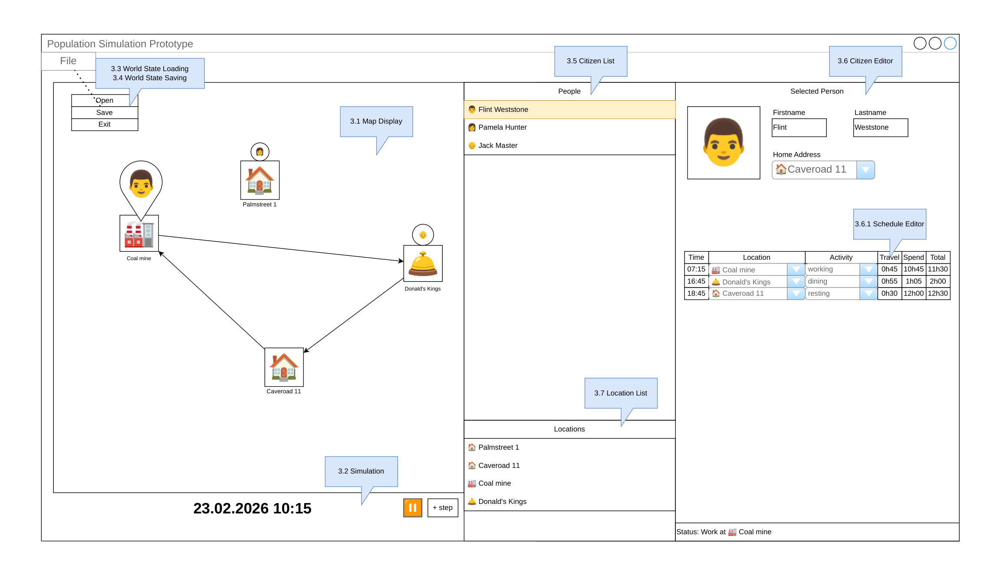

# wireframes

> **Source:** wireframes.pdf  
> **Pages:** 1  
> **Visual Content:** 1 image(s) extracted  

---

## Page 1

### Visual Content

**Diagram/Wireframe** (2304x1296, 0 colors):

### Text Content

Population Simulation Prototype
23.02.2026 10:15
+ step
File
Selected Person
👨
Firstname
Flint
🏠Caveroad 11
Home Address
Locations
🏠 Palmstreet 1
🏠 Caveroad 11
🏭 Coal mine
🛎️ Donald's Kings
People
👨 Flint Weststone
👩 Pamela Hunter
👴 Jack Master
🏠
Palmstreet 1
🏠
Caveroad 11
🛎️
Donald's Kings
🏭
Coal mine
👨
Status: Work at 🏭 Coal mine
👩
👴
⏸️
07:15
Time
Location
🏭 Coal mine
Activity
working
0h45
Travel
10h45
Spend
11h30
Total
16:45
🛎️ Donald's Kings
dining
0h55
1h05
2h00
18:45
🏠 Caveroad 11
resting
0h30
12h00 12h30
Open
Save
Exit
3.1 Map Display
3.2 Simulation
3.3 World State Loading
3.4 World State Saving
3.5 Citizen List
3.6 Citizen Editor
3.6.1 Schedule Editor
3.7 Location List
Lastname
Weststone

---

